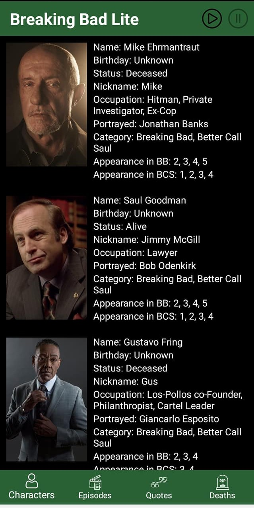

# breaking-bad-lite
An android application showing the characters, episodes, quotes and deaths from the renowned tv series **Breaking Bad** along with **Better Call Saul** 
It has been developed with android architecture components like **viewmodel**, **room persistent library**, **livedata**
The development follows **MVVM** pattern
The data has been collected from **Breaking Bad Free Api**

